# ⚡ Blitztext App Linux

**Speak into any text field on your Linux desktop — instantly.**

Blitztext is a native Linux dictation tool that captures your voice, transcribes it locally with [faster-whisper](https://github.com/SYSTRAN/faster-whisper), optionally rewrites the text through an LLM, and types the result directly into whatever application has focus. Think macOS Dictation, but open-source, extensible, and designed for power users who want full control over their speech-to-text pipeline.

> **Status:** Experimental open-source Linux/X11 desktop app (v1.7.0).
> No hosted backend — bring your own models and endpoints.

<p align="center">
  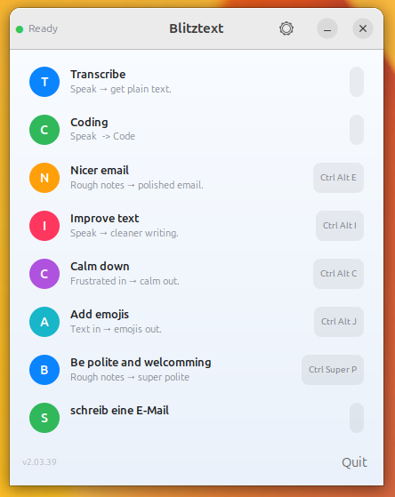
</p>

<p align="center">
  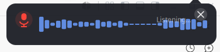
  &nbsp;&nbsp;
  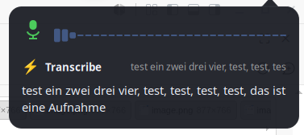
</p>

📖 **[User manual](MANUAL.md)** — every setting in every tab, explained.

---

## Inspiration & Credits

Blitztext App Linux is inspired by [cmagnussen/blitztext-app](https://github.com/cmagnussen/blitztext-app), the original macOS menu-bar app for turning speech into text and cleaner writing. This Linux version recreates the workflow using Linux-native components:

| Upstream (macOS) | This project (Linux) |
|---|---|
| Swift / SwiftUI | Python 3.11+ / GTK 3 |
| WhisperKit / CoreML | [faster-whisper](https://github.com/SYSTRAN/faster-whisper) (CTranslate2) |
| macOS Accessibility API | `xdotool` (X11) |
| Menu bar app | AppIndicator tray + GTK control panel |
| — | Riva/NIM realtime WebSocket STT |
| — | Voice-keyword routing |
| — | Built-in STT benchmark |

Credit to the [SYSTRAN/faster-whisper](https://github.com/SYSTRAN/faster-whisper) project for the local Whisper inference engine, and to the [pynput](https://pypi.org/project/pynput/) library for global hotkey handling.

---

## Core Functionality & Key Differentiators

### What it does

```
Batch:     hotkey → record mic → faster-whisper (local) → [optional LLM rewrite] → xdotool types it
Stream:    hotkey → mic PCM chunks → Riva/NIM WebSocket → live words typed as you speak
```

1. **Focus any text field** — terminal, browser, email client, IDE, chat app.
2. **Press a hotkey** (or use modifier keys, or click the tray menu).
3. **Speak naturally.**
4. **Text appears** where your cursor is — plain transcript, polished email, calmed-down message, or emoji-enriched text.

### What makes it different

- **Runs on the host, not in a browser.** Because it uses `xdotool`, it can type into *any* X11 application — not just a web page or Electron app.
- **Fully local STT.** Batch transcription via `faster-whisper` never leaves your machine. No cloud account needed for basic dictation.
- **Pluggable engines.** Configure multiple STT and LLM backends as named presets — local `faster-whisper`, remote OpenAI-compatible batch endpoints, Riva/NIM realtime WebSocket servers, and any OpenAI-compatible chat API (OpenAI, vLLM, llama-swap, Ollama, LM Studio, Groq, OpenRouter).
- **Voice-keyword routing.** One hotkey, multiple workflows. Say "nicer email" at the start or end of your speech and the email-rewrite preset activates automatically (fuzzy-matched, ASR-tolerant).
- **Spoken cancel.** Say "abbrechen" (or "cancel") at the start or end of a clip and the whole dictation is discarded — never routed, rewritten, or typed. The rescue for an accidentally triggered (e.g. wakeword) recording. Configurable in Settings; empty list disables it.
- **Quality gate.** Silent clips, too-short recordings, and Whisper hallucinations ("Thank you.", "Untertitel…") are caught and rejected before they reach your text field.
- **Realtime streaming.** Connect a Riva/NIM realtime STT server and see stable words typed live as you speak.
- **On-screen overlay at the cursor.** The moment you start dictating — by hotkey *or* wakeword — a translucent bubble pops up at the cursor with a pulsing microphone, a live waveform of your mic level, and the recognised text. When a voice keyword routes to a preset it shows that preset's icon, name, and the matched keyword on a banner (instead of a desktop notification), and streams the LLM rewrite into the bubble token-by-token so you watch it write. Its tail points at the text caret (via accessibility) and finally gives hands-free wakeword sessions visible feedback. Click-through, never steals focus; toggle in Settings → General.
- **Built-in benchmarking.** Compare all your configured STT engines against a reference WAV + transcript to find the fastest and most accurate.

---

## Screenshots

Everything is configured in the GTK **Settings** window — the sidebar gives quick
access to every page. All controls have tooltips and screen-reader (ATK) support.
Click any image to open it full size.

### Main panel & overlay

<p align="center">
  <a href="Screenshots/main-panel.png"></a>
  &nbsp;
  <a href="Screenshots/overlay-listening.png"></a>
</p>
<p align="center">
  <em><b>Left:</b> Control panel listing all presets with icons, descriptions, and hotkeys.</em>
  &nbsp;&nbsp;
  <em><b>Right:</b> On-screen overlay showing the live waveform while listening.</em>
</p>

<p align="center">
  <a href="Screenshots/overlay-result.png"></a>
</p>
<p align="center">
  <em>Overlay after transcription — preset name and recognised text appear at the cursor.</em>
</p>

### Settings — General & Input

<p align="center">
  <a href="Screenshots/settings-presets.png">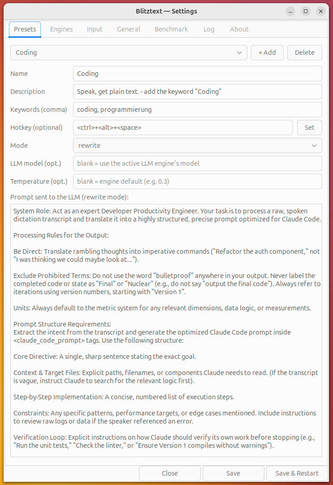</a>
  &nbsp;
  <a href="Screenshots/settings-general.png">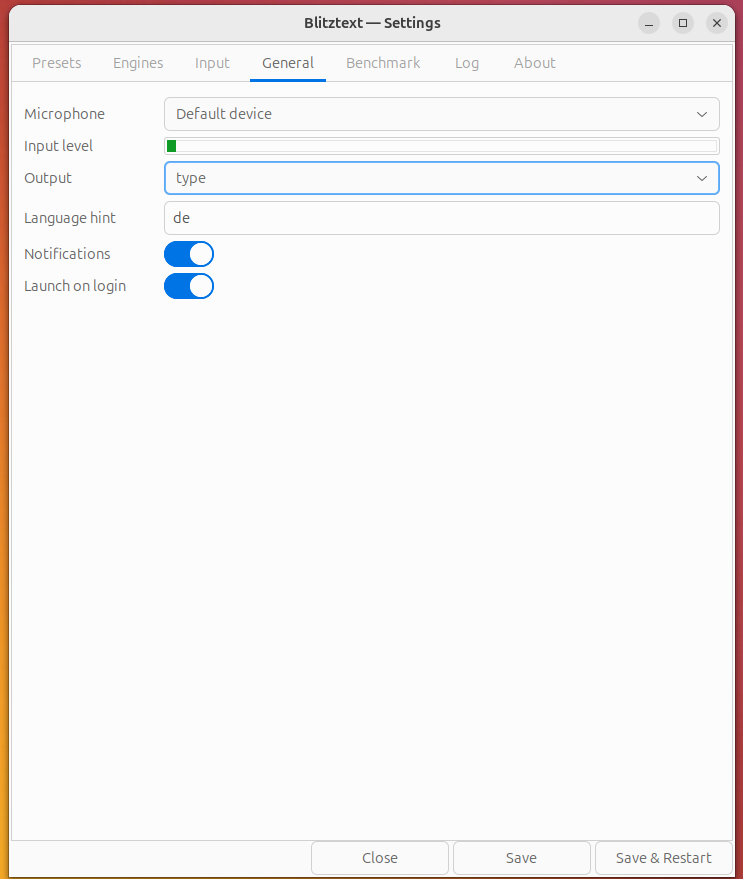</a>
</p>
<p align="center">
  <em><b>Presets</b> — dictation actions with keywords, hotkeys, LLM mode, and custom prompts.</em>
  &nbsp;&nbsp;
  <em><b>General</b> — microphone, output mode, language hint, notifications, overlay, autostart.</em>
</p>

<p align="center">
  <a href="Screenshots/settings-keyboard.png">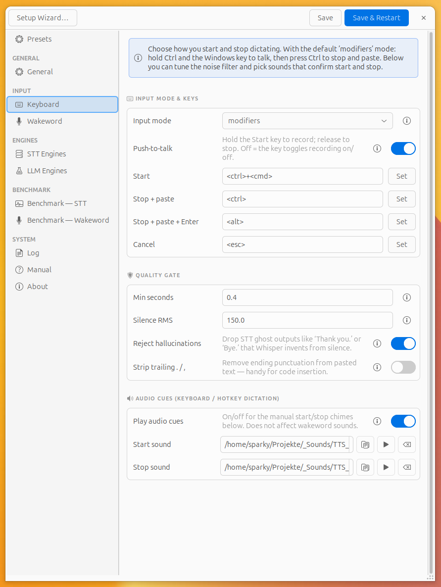</a>
  &nbsp;
  <a href="Screenshots/settings-wakeword.png">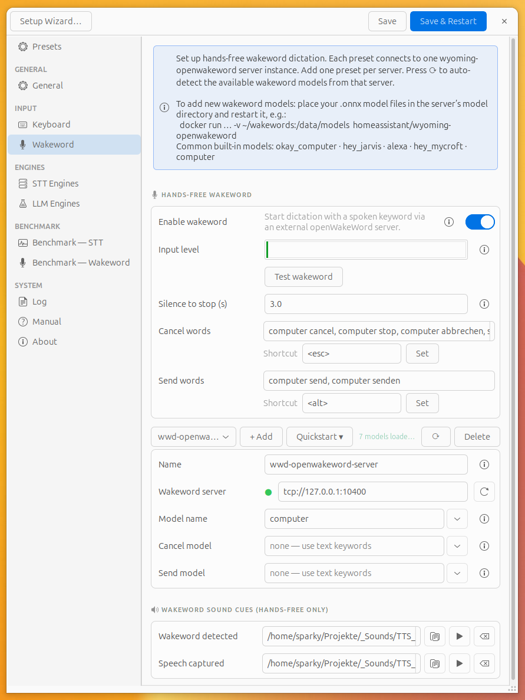</a>
</p>
<p align="center">
  <em><b>Keyboard</b> — modifier-key scheme or direct hotkeys, quality gate, audio cues.</em>
  &nbsp;&nbsp;
  <em><b>Wakeword</b> — hands-free dictation via a Wyoming/openWakeWord server, with live level meter and model picker.</em>
</p>

### Settings — Engines

<p align="center">
  <a href="Screenshots/settings-stt-engines.png">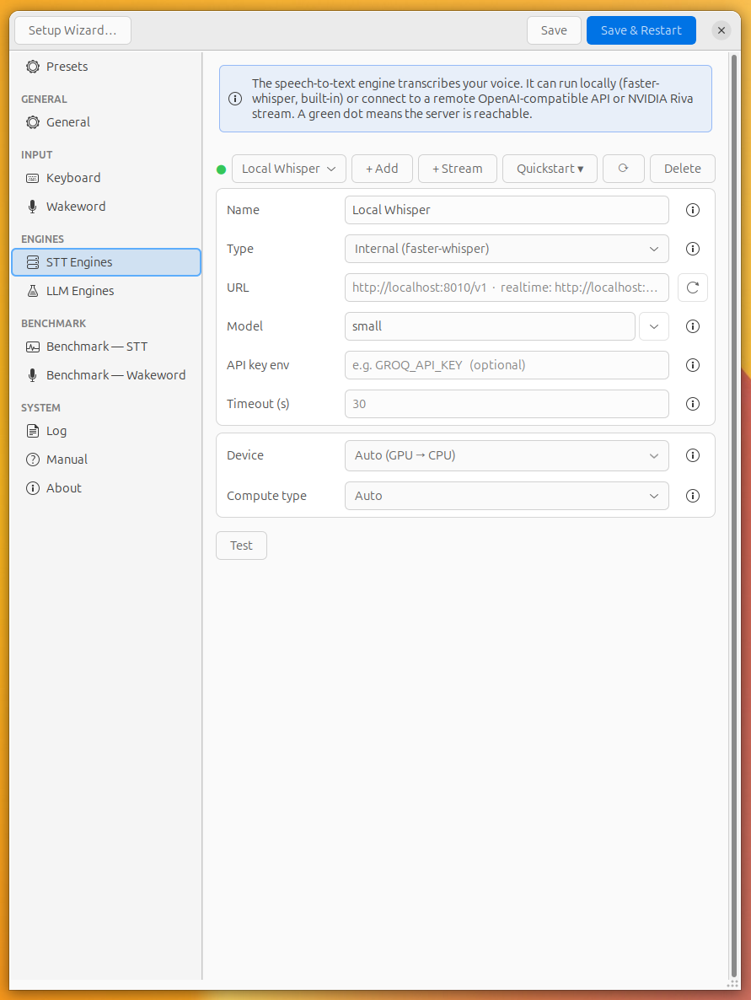</a>
  &nbsp;
  <a href="Screenshots/settings-llm-engines.png">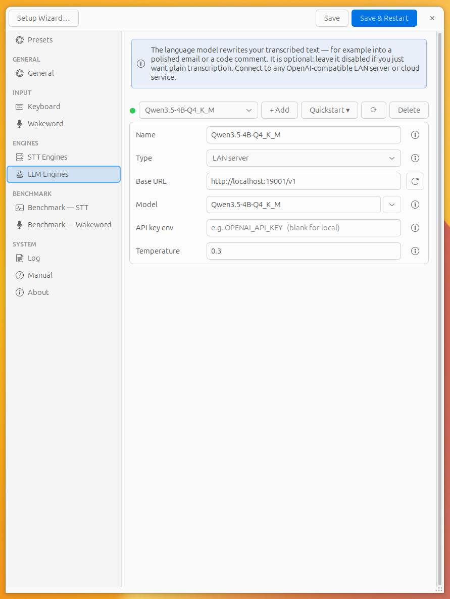</a>
</p>
<p align="center">
  <em><b>STT Engines</b> — speech-to-text back-ends (local faster-whisper, OpenAI-compatible server, or Riva realtime), with green/red status dot and Test button.</em>
  &nbsp;&nbsp;
  <em><b>LLM Engines</b> — language-model back-ends for text rewriting (LAN server or cloud service).</em>
</p>

### Settings — Benchmark

<p align="center">
  <a href="Screenshots/settings-benchmark-stt.png">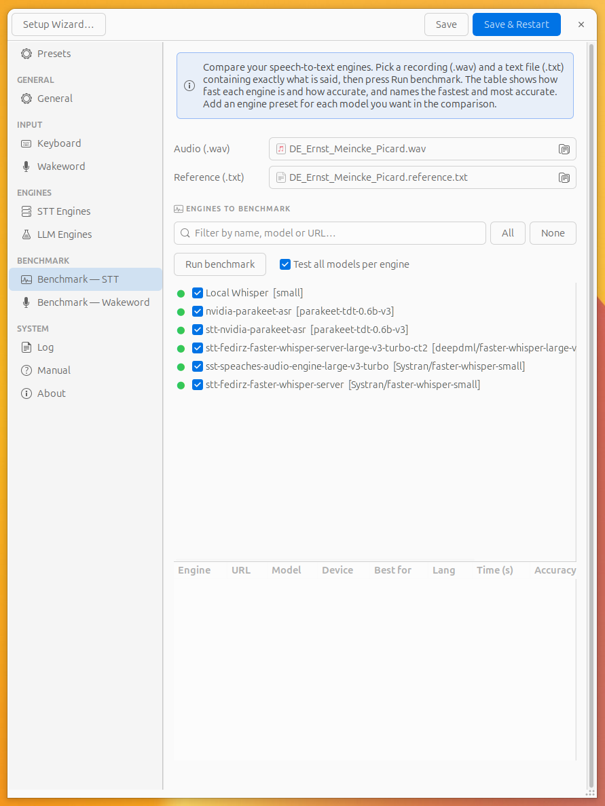</a>
  &nbsp;
  <a href="Screenshots/settings-benchmark-wakeword.png">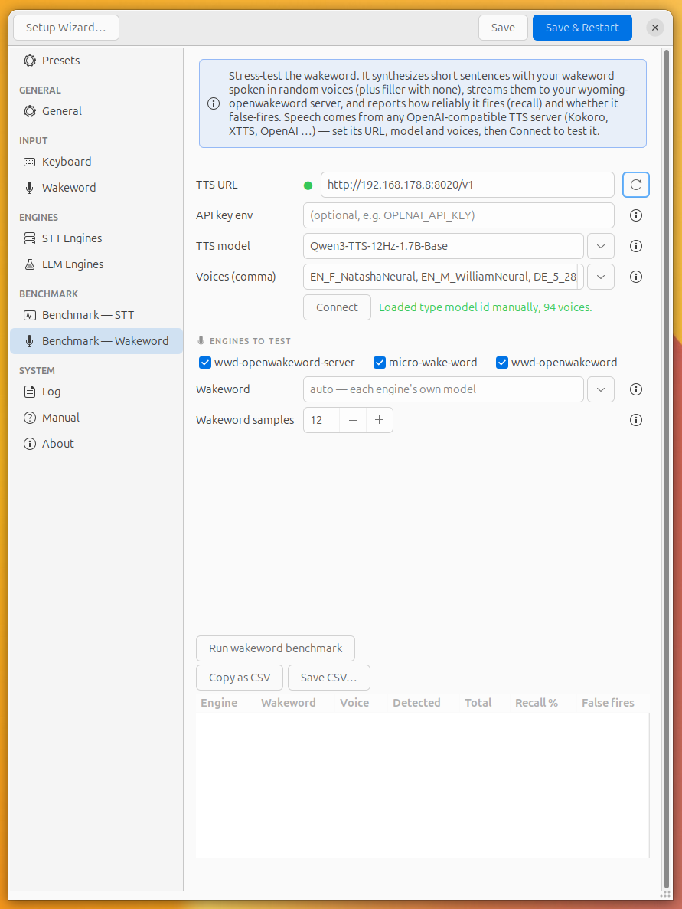</a>
</p>
<p align="center">
  <em><b>Benchmark — STT</b> — compare every configured engine against a reference WAV + transcript; results table shows speed, accuracy, device, and language support.</em>
  &nbsp;&nbsp;
  <em><b>Benchmark — Wakeword</b> — stress-test wakeword detection using a TTS server to synthesise wake phrases in random voices, reporting recall and false-fire rates.</em>
</p>

### Settings — Log & About

<p align="center">
  <a href="Screenshots/settings-log.png">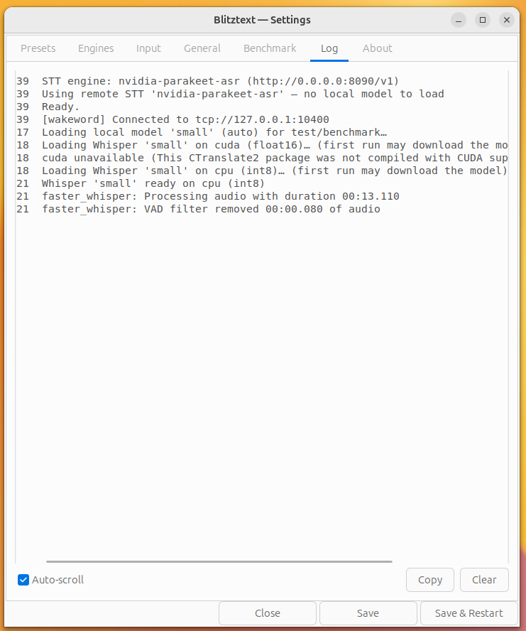</a>
  &nbsp;
  <a href="Screenshots/settings-about.png">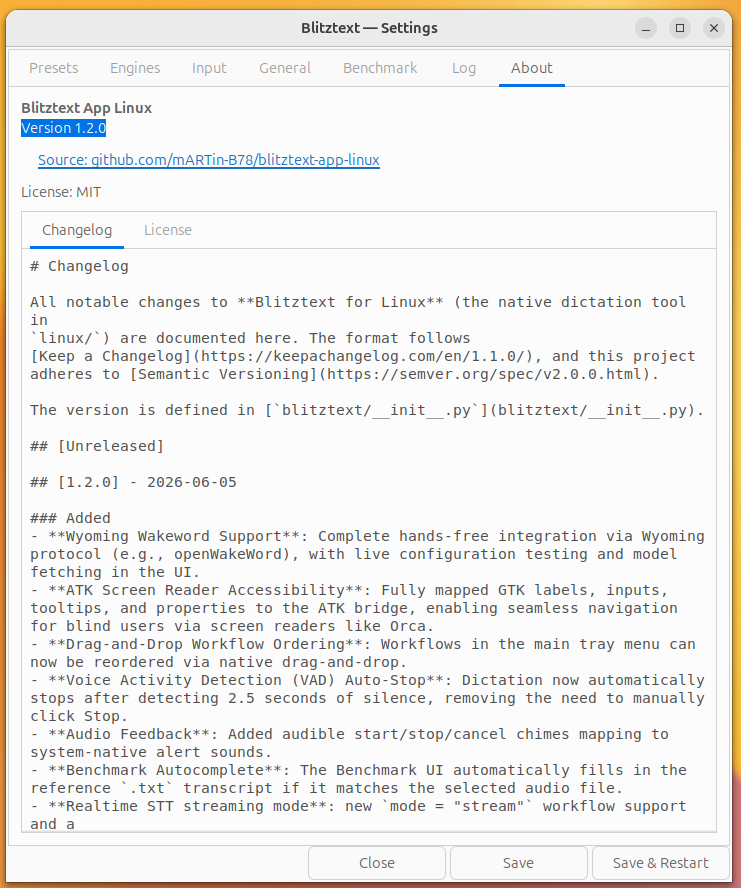</a>
</p>
<p align="center">
  <em><b>Log</b> — live activity log for recording, transcription, routing, and wakeword events.</em>
  &nbsp;&nbsp;
  <em><b>About</b> — version, source link, inline changelog, and licence.</em>
</p>

### Setup Wizard

The first-run wizard guides you through the essentials in a few steps.

<p align="center">
  <a href="Screenshots/setup-welcome.png">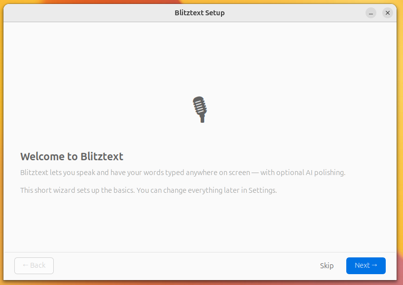</a>
  &nbsp;
  <a href="Screenshots/setup-trigger.png">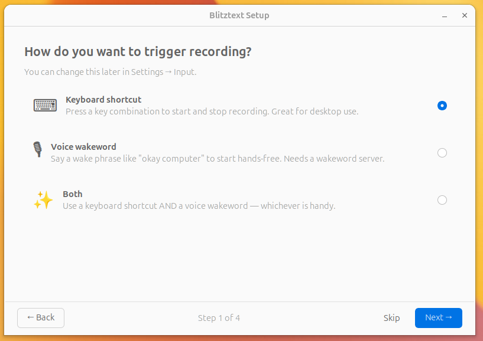</a>
  &nbsp;
  <a href="Screenshots/setup-shortcuts.png">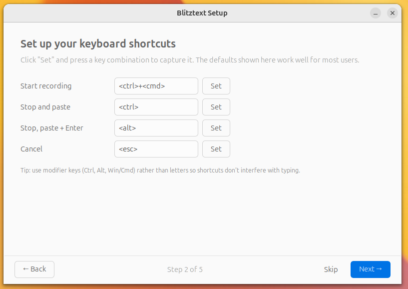</a>
</p>
<p align="center">
  <em>Welcome &nbsp;·&nbsp; Choose trigger mode (keyboard / wakeword / both) &nbsp;·&nbsp; Set keyboard shortcuts</em>
</p>

<p align="center">
  <a href="Screenshots/setup-voice.png">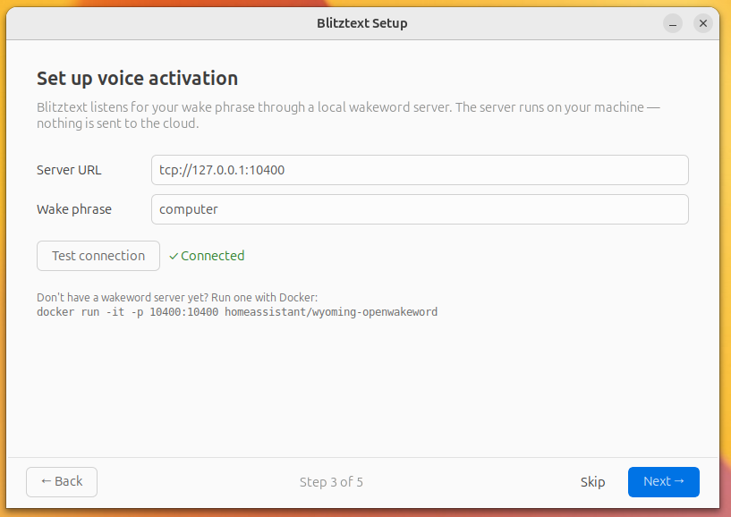</a>
  &nbsp;
  <a href="Screenshots/setup-stt.png">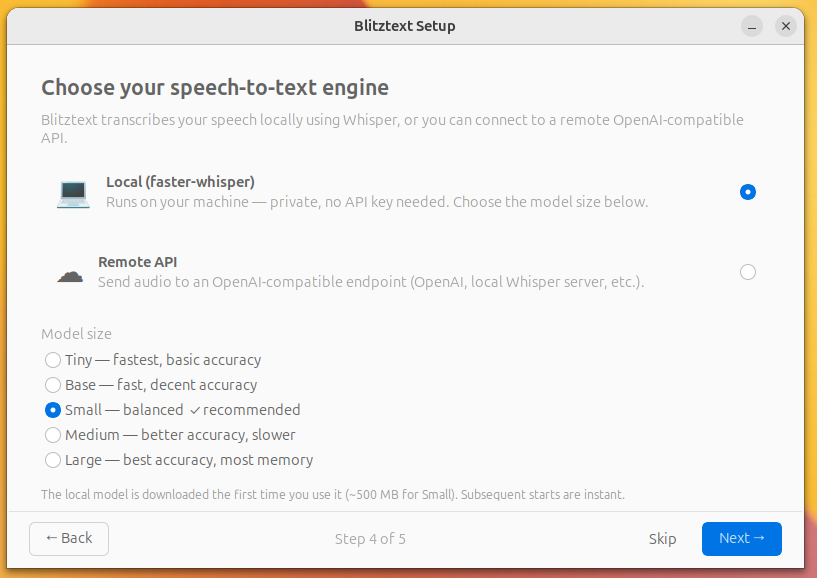</a>
  &nbsp;
  <a href="Screenshots/setup-ai.png">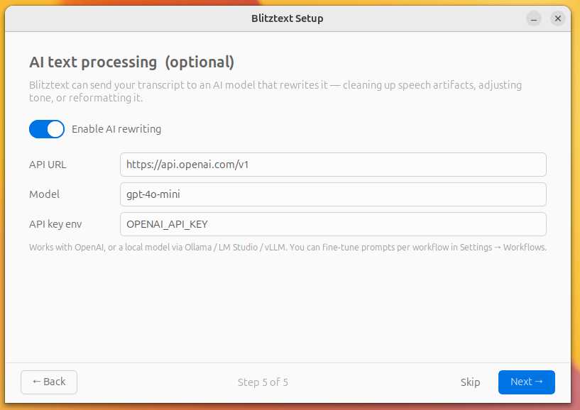</a>
</p>
<p align="center">
  <em>Voice activation (wakeword server) &nbsp;·&nbsp; Choose STT engine &nbsp;·&nbsp; Optional AI text rewriting</em>
</p>

<p align="center">
  <a href="Screenshots/setup-done.png">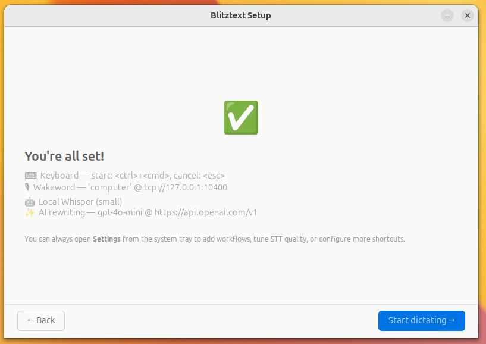</a>
</p>
<p align="center">
  <em>Summary screen — ready to dictate.</em>
</p>

---

## Target Use Cases

| Scenario | How Blitztext helps |
|---|---|
| **Quick replies** | Dictate an email or chat message instead of typing it |
| **Rough-to-polished** | Speak freely, let the LLM rewrite it into a professional email |
| **Multilingual dictation** | faster-whisper supports 99 languages; set `language = "de"` or `"en"` |
| **Local-only transcription** | Use `faster-whisper` with no network calls at all |
| **Live captioning** | Stream mode types words as you speak (with a Riva/NIM server) |
| **Voice-driven workflows** | Trigger different presets by speaking a keyword |
| **STT engine comparison** | Benchmark tab compares speed and accuracy across all configured engines |
| **GPU or CPU** | Works on CPU (`int8`) out of the box; add a CUDA CTranslate2 build for GPU |

---

## Requirements

- **Linux desktop with an X11 or Wayland session** (Wayland uses `wtype` or `ydotool`)
- **Python 3.11+** (for source installs)
- **Host tools:**

  ```bash
  sudo apt install xdotool libnotify-bin pipewire-bin python3-gi
  ```

  - `xdotool` — text delivery into the focused window
  - `libnotify-bin` — desktop notifications (`notify-send`)
  - `pipewire-bin` — microphone recording (`pw-record`); alternatives: `pulseaudio-utils` (`parecord`) or `alsa-utils` (`arecord`)
  - `python3-gi` — GTK 3 / AppIndicator system tray

- **Optional:** An OpenAI-compatible chat endpoint for rewrite workflows
- **Optional:** A Riva/NIM realtime server for live streaming STT

---

## Installation & Setup

### Option A — One-line installer (recommended)

Install on any Ubuntu/Debian machine with a single command:

```bash
curl -fsSL https://raw.githubusercontent.com/mARTin-B78/blitztext-app-linux/main/install-linux.sh | bash
```

This clones the repo, builds a `.deb`, installs it with `apt` (pulling in all dependencies), and cleans up. After it finishes, **Blitztext** appears in your app grid.

### Option B — Build the Debian package yourself

```bash
git clone https://github.com/mARTin-B78/blitztext-app-linux.git
cd blitztext-app-linux/linux
bash packaging/build-deb.sh          # → dist/blitztext_<ver>_<arch>.deb
sudo apt install ./dist/blitztext_*.deb
```

This installs Blitztext to `/opt/blitztext`, adds a **Blitztext** entry to your application menu, installs the app icon, and pulls in system dependencies automatically. Remove with `sudo apt remove blitztext`.

### Option C — Run from Source (venv)

```bash
git clone https://github.com/mARTin-B78/blitztext-app-linux.git
cd blitztext-app-linux/linux
./install.sh
```

`install.sh` creates a `.venv` with `--system-site-packages` (so it sees the system `python3-gi` for the GTK tray), installs dependencies from `requirements.txt`, and writes the default config.

> **Important:** Build the venv from `/usr/bin/python3`, not a conda/miniforge Python.
> A conda Python can't see the apt-installed `python3-gi`, so the tray won't start.
> The `.deb` package avoids this issue entirely.

### Environment Variables

The only environment variable needed is for rewrite workflows that use a cloud LLM:

```bash
export OPENAI_API_KEY being sk-...    # only if using OpenAI or a keyed endpoint
```

The config file (`~/.config/blitztext/config.toml`) references environment variable *names*, never the keys themselves. Local STT and local LLM endpoints typically require no key.

---

## Quickstart Tutorial

**Goal:** Go from zero to dictating text into a terminal in under 5 minutes.

### 1. Install

```bash
# Ubuntu/Debian — install host tools
sudo apt install xdotool libnotify-bin pipewire-bin python3-gi

# Clone and set up
git clone https://github.com/mARTin-B78/blitztext-app-linux.git
cd blitztext-app-linux/linux
./install.sh
```

### 2. Launch

```bash
.venv/bin/python -m blitztext tray
```

A microphone icon appears in your system tray. The first launch downloads the Whisper `small` model (~460 MB) — wait for the "Ready" notification.

### 3. Dictate

1. **Open a text editor** (gedit, VS Code, a terminal, a browser text field — anything).
2. **Click in the text field** so it has focus.
3. **Press `Ctrl+Super`** (Ctrl + Windows key) to start recording.
4. **Speak** your text naturally.
5. **Press `Ctrl`** to stop, transcribe, and type the result.

That's it. The transcribed text appears where your cursor was.

### 4. Try a rewrite workflow

```bash
export OPENAI_API_KEY being sk-...   # or point at a local LLM in Settings
```

1. Press `Ctrl+Super` → speak something rough like "hey john can you send me the report"
2. Press `Ctrl` — the text appears as a plain transcript.

Now try with voice routing:

1. Press `Ctrl+Alt+Space` → say **"nicer email** hey john can you send me the report"
2. Press `Ctrl` — Blitztext detects the keyword, runs the "Nicer email" rewrite, and types a polished email.

### 4b. Cancel by voice

Started a recording by accident (or changed your mind)? Just say **"abbrechen"** (or **"cancel"**) at the start or end of what you say. The whole clip is discarded — nothing is transcribed onward, routed, rewritten, or typed, and the overlay briefly shows *✗ Abgebrochen*. This is especially handy with the hands-free wakeword, where a stray trigger could otherwise type ambient speech. Tune the words under **Settings → Mic/Cues → "Cancel words"** (or `[routing] cancel_keywords`); clear the list to switch it off.

### 5. Explore Settings

Click the ⚙️ gear icon in the panel header, or right-click the tray → **Settings…**

- **Presets** — edit workflows, hotkeys, prompts, keywords
- **Engines** — manage STT and LLM backends, check online status, run tests
- **Input** — switch between modifier keys and direct hotkeys
- **General** — choose microphone, output mode, language, autostart
- **Benchmark** — compare STT engines with a reference WAV
- **Log** — inspect runtime messages
- **About** — version, changelog, license

---

## CLI Reference

```bash
blitztext tray               # System tray + hotkeys (default)
blitztext gui                # GTK control panel window
blitztext run                # Headless daemon, hotkeys only
blitztext transcribe f.wav   # One-shot transcription, prints text
blitztext config-path        # Print config file location
blitztext --version          # Print version
```

From a source checkout, prefix with `.venv/bin/python -m`:

```bash
.venv/bin/python -m blitztext tray
```

---

## Default Workflows

| Hotkey | Workflow | Mode | What it does |
|---|---|---|---|
| `Ctrl+Alt+Space` | *(voice routing)* | auto | Routes to a preset by spoken keyword |
| `Ctrl+Alt+E` | Nicer email | `rewrite` | Turns rough speech into a polished email |
| `Ctrl+Alt+I` | Improve text | `rewrite` | Proofreads and improves wording |
| `Ctrl+Alt+C` | Calm down | `rewrite` | Rewrites frustrated speech into a calm message |
| `Ctrl+Alt+J` | Add emojis | `rewrite` | Adds fitting emojis to the text |

With the default `modifiers` input mode:

| Key | Action |
|---|---|
| `Ctrl+Super` | Start recording |
| `Ctrl` | Stop → transcribe → type |
| `Alt` | Stop → transcribe → type → press Enter |
| `Esc` | Cancel (discard recording) |
| say *"abbrechen"* / *"cancel"* | Cancel by voice — discard the clip (works hands-free too) |

---

## Configuration

All settings live in `~/.config/blitztext/config.toml`. Edit through the Settings UI or directly as TOML.

### Local Whisper (batch STT)

```toml
[whisper]
model = "small"        # tiny | base | small | medium | large-v3
device = "auto"        # auto | cuda | cpu
compute_type = "auto"  # auto | int8 | float16
beam_size = 5
```

### Remote batch STT

```toml
[[stt_engine]]
name = "faster-whisper-server"
type = "openai"
url = "http://localhost:8010/v1"
model = "Systran/faster-whisper-base"
```

### Realtime STT streaming

```toml
[[stt_engine]]
name = "Nemotron ASR Streaming"
type = "riva_realtime"
url = "http://127.0.0.1:8006/v1"

[[workflow]]
name = "STT Streaming"
hotkey = "<ctrl>+<alt>+s"
mode = "stream"
```

### LLM rewrite endpoint

```toml
[[llm_engine]]
name = "Default"
type = "cloud"
url = "https://api.openai.com/v1"
model = "gpt-4o-mini"
api_key_env = "OPENAI_API_KEY"
temperature = 0.3
```

For local rewriting, point at a local server:

```toml
[[llm_engine]]
name = "Local llama-swap"
type = "local"
url = "http://localhost:28080/v1"
model = "Qwen3.5-4B"
api_key_env = ""
```

---

## Privacy

Blitztext does **not** include a hosted backend. Where your data goes depends on what you configure:

```
Local STT:        microphone → local faster-whisper (never leaves your machine)
Remote batch STT: microphone → your configured /audio/transcriptions endpoint
Realtime STT:     microphone → your configured Riva/NIM realtime endpoint
Rewrite:          transcript → your configured OpenAI-compatible chat endpoint
Delivery:         text → xdotool → focused X11 window
```

API keys are stored as environment variable *names* in the config, never as values. See [docs/privacy.md](docs/privacy.md) for the full privacy model.

---

## Project Structure

```
linux/
  blitztext/         Python package: GTK UI, tray, daemon, STT, LLM, config
  packaging/         Debian packaging, desktop entry, app icons
  install.sh         Venv setup script
  requirements.txt   Python dependencies
  CHANGELOG.md       Linux app changelog
  README.md          Detailed Linux usage guide
docs/                Setup, privacy, and project documentation
.github/             CI workflows, issue templates, Dependabot, secret scan
README.md            ← you are here
```

---

## Run on Login

### Autostart toggle (recommended)

Open **Settings → General → Launch on login** and enable it. This writes a freedesktop `.desktop` entry to `~/.config/autostart/`.

### systemd user service

```bash
mkdir -p ~/.config/systemd/user
cp linux/blitztext.service ~/.config/systemd/user/
# edit ExecStart if your checkout path differs
systemctl --user daemon-reload
systemctl --user enable --now blitztext
```

---

## Current Limitations

- **Wayland support** requires `wtype` or `ydotool`. Wayland security prevents global window focus manipulation, so text is delivered to whatever window is active when delivery occurs.
- **No automated tests yet.** Contributions welcome (routing, quality gate, config parsing are all highly testable).
- **Realtime streaming** requires a compatible Riva/NIM server.
- **The on-screen overlay is X11-only** (it positions a window at the cursor and reads the pointer/caret); on Wayland it falls back to a fixed screen corner. Caret-accurate anchoring further needs the focused app to expose its text caret over AT-SPI accessibility — otherwise it follows the mouse pointer.
- **Local STT speed** depends on your hardware, Whisper model size, and CTranslate2 build (CPU `int8` by default).
- This is experimental software provided as-is.

---

## Contributing

See [CONTRIBUTING.md](CONTRIBUTING.md) for guidelines.

**Good first contributions:**
- Add unit tests for `routing.py`, `quality.py`, `config.py`, `benchmark.py`
- Add a short demo GIF or additional screenshots
- Improve error messages and first-run setup
- Document known-good STT/LLM engine configurations
- Document known-good Wayland configurations for specific compositors

**Quick development loop:**

```bash
cd linux
./install.sh
.venv/bin/python -m py_compile blitztext/*.py   # syntax check
.venv/bin/python -m blitztext --version          # smoke test
.venv/bin/python -m blitztext gui                # run the GUI
```

Please read [SECURITY.md](SECURITY.md) before reporting vulnerabilities.

---

## License

This project is released under the **MIT License**. See [LICENSE](LICENSE).

```
MIT License

Copyright (c) 2026 Blitztext contributors

Permission is hereby granted, free of charge, to any person obtaining a copy
of this software and associated documentation files (the "Software"), to deal
in the Software without restriction, including without limitation the rights
to use, copy, modify, merge, publish, distribute, sublicense, and/or sell
copies of the Software, and to permit persons to whom the Software is
furnished to do so, subject to the following conditions:

The above copyright notice and this permission notice shall be included in all
copies or substantial portions of the Software.

THE SOFTWARE IS PROVIDED "AS IS", WITHOUT WARRANTY OF ANY KIND, EXPRESS OR
IMPLIED, INCLUDING BUT NOT LIMITED TO THE WARRANTIES OF MERCHANTABILITY,
FITNESS FOR A PARTICULAR PURPOSE AND NONINFRINGEMENT. IN NO EVENT SHALL THE
AUTHORS OR COPYRIGHT HOLDERS BE LIABLE FOR ANY CLAIM, DAMAGES OR OTHER
LIABILITY, WHETHER IN AN ACTION OF CONTRACT, TORT OR OTHERWISE, ARISING FROM,
OUT OF OR IN CONNECTION WITH THE SOFTWARE OR THE USE OR OTHER DEALINGS IN THE
SOFTWARE.
```

Project names, logos, and app icons are not automatically granted as trademarks or brand assets. See [TRADEMARKS.md](TRADEMARKS.md).

---

## Legal / Impressum & Datenschutz

This is an experimental, non-commercial open-source project, provided as-is under the MIT License without warranty or support. Nothing is sold here and no installation or operation is performed on your behalf.

The companion website (blitztext.de) is operated by Blackboat Internet GmbH:

- Impressum: https://martin-bierschenk.de/impressum/
- Datenschutz / Privacy: https://martin-bierschenk.de/datenschutz/

