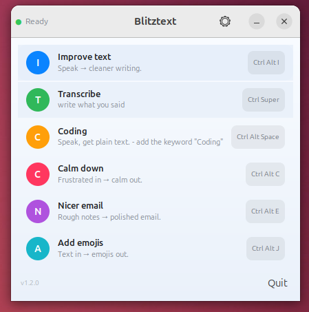
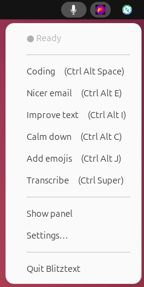
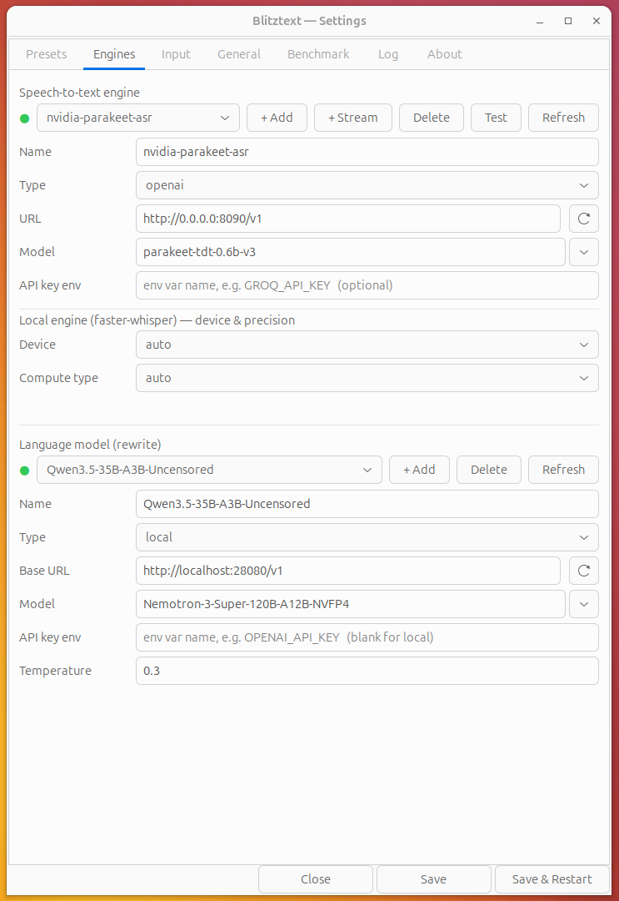
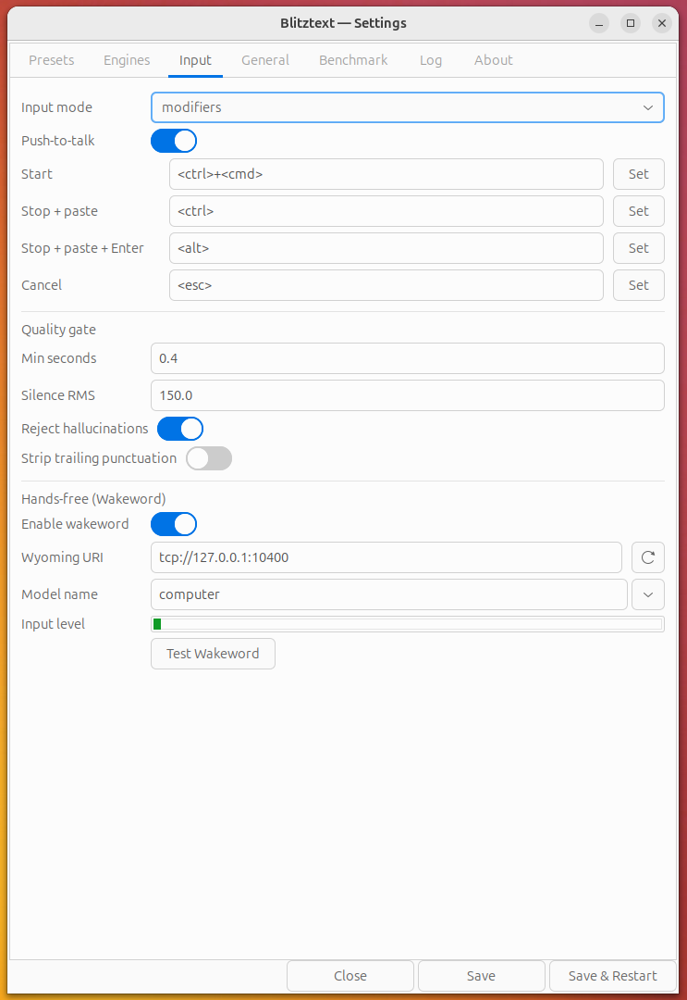
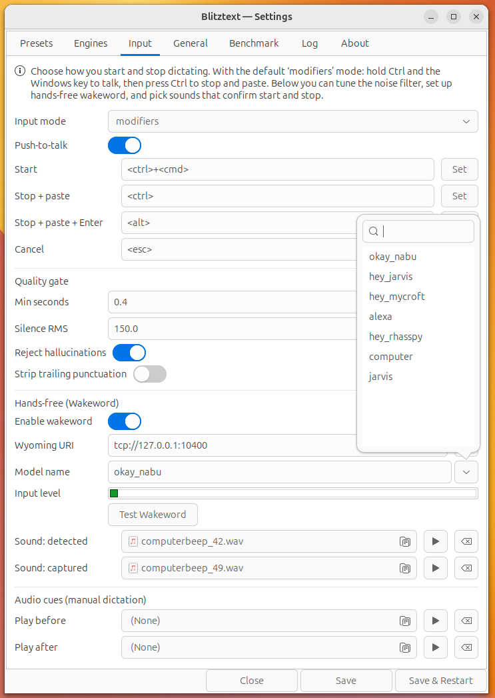
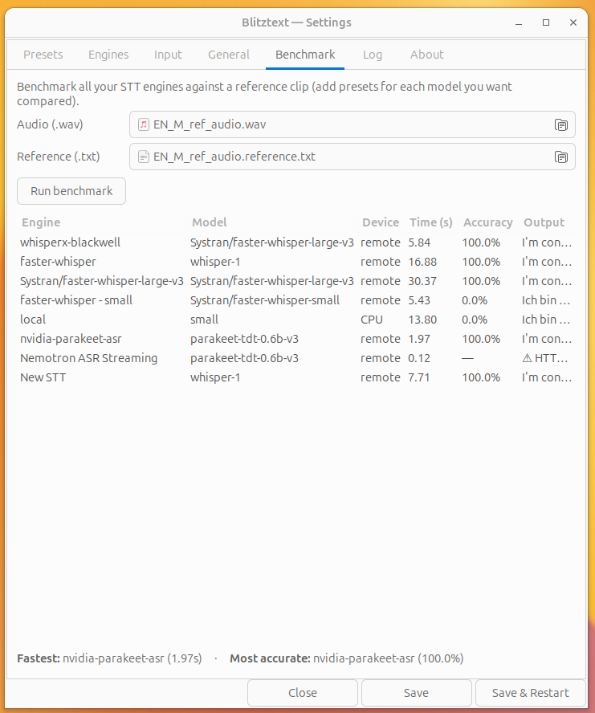

# Blitztext for Linux (native dictation)

A native Linux port of the Blitztext workflow: **focus any text field → press a
hotkey → speak → the text is typed into that field**, optionally rewritten by an
LLM first (e.g. turn rough speech into a nicer, more detailed email).

This runs **on the host** (not in a container), so it can type into *any*
application — the Linux equivalent of the macOS app's Accessibility-based
auto-paste. (A sandboxed Docker/browser version can't do that; an earlier
experiment along those lines was moved out to
`~/Docker/correspondence/blitztext`.) Batch transcription is **local** via
[faster-whisper]; live streaming can use a local Riva/NIM realtime server. Only
the optional rewrite step calls out to an LLM.

<p align="center">
  
  &nbsp;&nbsp;
  
</p>

## Inspiration

Blitztext App Linux is inspired by [cmagnussen/blitztext-app](https://github.com/cmagnussen/blitztext-app), the original macOS menu-bar workflow for turning speech into text and cleaner writing. This Linux version keeps the workflow but uses Linux-native pieces: GTK, AppIndicator, global hotkeys, `faster-whisper`, optional Riva/NIM realtime STT, and `xdotool`.

## How it works

```
hotkey ──▶ record mic (pw-record/arecord) ──▶ faster-whisper (local)
                                                    │
                          ┌── mode "transcribe" ────┤
                          │                          └── mode "rewrite": LLM (OpenAI-compatible)
                          ▼
                 xdotool types it into the focused window

mode "stream" ──▶ mic PCM chunks ──▶ Riva/NIM realtime WebSocket ──▶ live xdotool typing
```

Each normal hotkey **toggles**: press to start recording, press again to stop —
then it transcribes, optionally rewrites, and types the result where your cursor
is. Streaming workflows type stable words live while you speak.

**Cancel by voice:** say *"abbrechen"* (or *"cancel"*) at the start or end of a
clip and the whole dictation is discarded — never routed, rewritten, or typed.
It's the rescue for an accidentally triggered (e.g. wakeword) recording. Set the
words under `[routing] cancel_keywords` (default `["abbrechen", "cancel"]`; an
empty list turns it off).

While you dictate, an optional **on-screen overlay** (Settings → General →
"Visual overlay", default on) shows a translucent bubble at the cursor with a
pulsing microphone, a live waveform of your mic level, and the recognised text —
word-by-word in streaming mode, or the final result as a brief confirmation. Its
tail points at the text caret (via AT-SPI accessibility) or the mouse pointer; it
is click-through, never steals focus, and also gives hands-free wakeword sessions
visible feedback. Tune the anchor with `[general] overlay_anchor`. X11 only.

## Screenshots

Everything is configured in the **Settings** window — every tab has tooltips and
screen-reader (ATK) support. Click any image to open it full size.

<p align="center">
  <a href="../Screenshots/settings-presets.png"></a><br>
  <em><b>Presets</b> — your dictation actions. Each preset is either a plain transcription or an LLM rewrite, and carries its own spoken keyword(s) for voice routing, an optional global hotkey, and a custom rewrite prompt.</em>
</p>

<p align="center">
  <a href="../Screenshots/settings-engines.png"></a><br>
  <em><b>Engines</b> — your speech-to-text and language-model back-ends, local or remote. Add and rename engines, watch live online/offline status, and pick models from a searchable list fetched straight from the endpoint.</em>
</p>

<p align="center">
  <a href="../Screenshots/settings-input.png"></a><br>
  <em><b>Input</b> — how you start and stop dictation: the modifier-key scheme (Ctrl+Win / Ctrl / Alt / Esc) or custom hotkeys, plus the silence-based auto-stop (VAD), the quality gate, and audio cues.</em>
</p>

<p align="center">
  <a href="../Screenshots/wakeword.png"></a><br>
  <em><b>Wakeword (hands-free)</b> — point Blitztext at a Wyoming/openWakeWord server, choose a wake model, and test the connection live so a spoken keyword starts dictation with no keys at all.</em>
</p>

<p align="center">
  <a href="../Screenshots/settings-general.png"></a><br>
  <em><b>General</b> — core preferences: microphone with a live level meter, output mode (type vs. paste), language hint, type delay, the on-screen dictation overlay, and autostart on login.</em>
</p>

<p align="center">
  <a href="../Screenshots/settings-benchmark.png"></a><br>
  <em><b>Benchmark</b> — compare every configured STT engine against a reference WAV + transcript to find the fastest and most accurate, with a Device column (CPU / GPU / remote).</em>
</p>

<p align="center">
  <a href="../Screenshots/settings-log.png"></a><br>
  <em><b>Log</b> — the in-app log buffer: a live view of recording, transcription, routing, and wakeword events for quick troubleshooting.</em>
</p>

<p align="center">
  <a href="../Screenshots/settings-about.png"></a><br>
  <em><b>About</b> — version, source link, changelog, and licence.</em>
</p>

## Requirements

- **X11 session** (this uses `xdotool`; Wayland would need `ydotool`/`wtype`).
- Host tools: `xdotool`, `notify-send` (libnotify-bin), and a recorder
  (`pw-record` from pipewire, or `arecord`/`parecord`).
  ```bash
  sudo apt install xdotool libnotify-bin pipewire-bin
  ```
- Python 3.11+.
- Optional realtime STT streaming: a Riva/NIM realtime server such as Nemotron
  ASR Streaming, reachable through `/v1/realtime`.

## Install

### Option A — Debian package (recommended on Ubuntu/Debian)

Build a `.deb` and install it with the Software app or apt:

```bash
cd linux
bash packaging/build-deb.sh            # -> dist/blitztext_<ver>_arm64.deb
sudo apt install ./dist/blitztext_*.deb   # or double-click the .deb in Files
```

This installs `blitztext` to `/opt/blitztext` (a self-contained bundle — no pip
step), adds a **Blitztext** entry to your app grid, and pulls in the system deps
(`python3-gi`, `xdotool`, `libnotify-bin`, a recorder). Launch it from the app
grid, or run `blitztext` / `blitztext gui` from a terminal. Remove with
`sudo apt remove blitztext`.

### Option B — run from source (venv)

```bash
cd linux
./install.sh
```

This creates `.venv`, installs the Python dependencies from `requirements.txt`,
and writes the default config to `~/.config/blitztext/config.toml`.

> For the **tray** from source, the venv must be built on a Python that can see
> the system `python3-gi` — `install.sh` uses `python3 -m venv
> --system-site-packages`, so use the system `/usr/bin/python3` (a conda/miniforge
> Python won't see the apt-installed `gi`). The `.deb` handles this for you.

## Run

Three front-ends, same engine layer (STT engines + global hotkeys + xdotool typing):

```bash
# optional: only needed for the "rewrite" workflows
export OPENAI_API_KEY=sk-...

.venv/bin/python -m blitztext tray   # system-tray menu (macOS-menu-bar-like, default)
.venv/bin/python -m blitztext gui    # control-panel window
.venv/bin/python -m blitztext run    # headless, hotkeys only
```

### Realtime STT streaming

For Nemotron ASR Streaming, add a realtime engine in **Settings > Engines** with
`+ Stream`, save/restart, then create or edit a workflow with `mode = "stream"`.
The default realtime URL is:

```toml
[[stt_engine]]
name = "Nemotron ASR Streaming"
type = "riva_realtime"
url = "http://127.0.0.1:8006/v1"
model = ""

[[workflow]]
name = "STT Streaming"
hotkey = "<ctrl>+<alt>+s"
mode = "stream"
```

The current Nemotron ASR Streaming model exposed by the tested NIM is English
`en-US`, so use `language = "en"` or `language = "en-US"` in `[general]` for
that engine.

### System tray (recommended)

The tray is the closest match to the macOS menu-bar app: a status icon with a
menu listing every workflow (click to record), plus **Show panel**, **Settings…**,
and **Quit**. It needs PyGObject (`python3-gi`) and the GTK/AppIndicator
typelibs — already present on a standard Ubuntu GNOME install (the `.deb`
declares them as dependencies):

```bash
sudo apt install python3-gi      # usually already installed
.venv/bin/python -m blitztext tray
```

If PyGObject isn't visible, `tray` prints this hint and falls back to the
window. The venv is created with `--system-site-packages` so it can see the
system `gi` — build it from `/usr/bin/python3`, not a conda/miniforge Python.

Either way, focus any text field and trigger a workflow — by tray menu, panel
button, or hotkey (defaults):

| Hotkey                  | Workflow      | What it does                              |
| ----------------------- | ------------- | ----------------------------------------- |
| `Ctrl+Alt+Space`        | Transcribe    | Types the raw transcript                  |
| `Ctrl+Alt+E`            | Nicer email   | Rewrites speech into a polished email     |
| `Ctrl+Alt+I`            | Improve text  | Proofreads / improves wording             |
| `Ctrl+Alt+C`            | Calm down     | Rewrites an angry message into a calm one |
| `Ctrl+Alt+J`            | Add emojis    | Adds fitting emojis                       |

## Configuration

Everything lives in `~/.config/blitztext/config.toml` (`python -m blitztext
config-path` prints the location). You can change hotkeys, the Whisper model, and
the rewrite endpoint, and add/edit `[[workflow]]` blocks with your own prompts.

### Local Whisper

```toml
[whisper]
model = "small"      # tiny|base|small|medium|large-v3, or a local model path
device = "auto"      # auto tries cuda, falls back to cpu
compute_type = "auto"
```

> On this arm64 host the pip `ctranslate2` wheel is **CPU-only**, so it runs on
> the Grace CPU with `int8`. That's fast for dictation (≈2s for a 10s clip with
> `small`). `device = "auto"` attempts CUDA and falls back automatically — to get
> GPU you'd need a CUDA-enabled CTranslate2 build for aarch64/sm_121.

### Rewrite endpoint (OpenAI *or* your local LLM)

```toml
[rewrite]
base_url = "https://api.openai.com/v1"   # or e.g. http://localhost:8000/v1 for vLLM/llama-swap
api_key_env = "OPENAI_API_KEY"
model = "gpt-4o-mini"
```

Point `base_url` at a local OpenAI-compatible server (vLLM, llama-swap) to keep
rewriting fully on-box too.

## Run on login

See [`blitztext.service`](blitztext.service) for a systemd **user** unit.

## Verified

On this machine (Ubuntu/GNOME, X11, GB10): recorder → valid 16 kHz WAV;
faster-whisper CPU transcription accurate; config + all hotkeys parse; and
`xdotool` typing of German text into a focused GTK field. The live global-hotkey
loop and the LLM rewrite HTTP call were not auto-tested here (the former hijacks
the keyboard during a session; the latter needs your key) — try them with the
`run` command above.

## CLI

```bash
python -m blitztext tray               # tray menu (default)
python -m blitztext gui                # control-panel window
python -m blitztext run                # headless daemon, hotkeys only
python -m blitztext transcribe f.wav   # one-shot, prints text (no hotkeys)
python -m blitztext config-path        # print config location
```

[faster-whisper]: https://github.com/SYSTRAN/faster-whisper

## License

Code is released under the MIT License. See [../LICENSE](../LICENSE).

Project names, logos, and app icons are not automatically granted as trademarks or brand assets. See [../TRADEMARKS.md](../TRADEMARKS.md).

## Legal / Impressum & Datenschutz

This is an experimental, non-commercial open-source project, provided as-is under the MIT License without warranty or support. Nothing is sold here and no installation or operation is performed on your behalf.

The companion website (blitztext.de) is operated by Blackboat Internet GmbH:

- Impressum: https://martin-bierschenk.de/impressum/
- Datenschutz / Privacy: https://martin-bierschenk.de/datenschutz/
